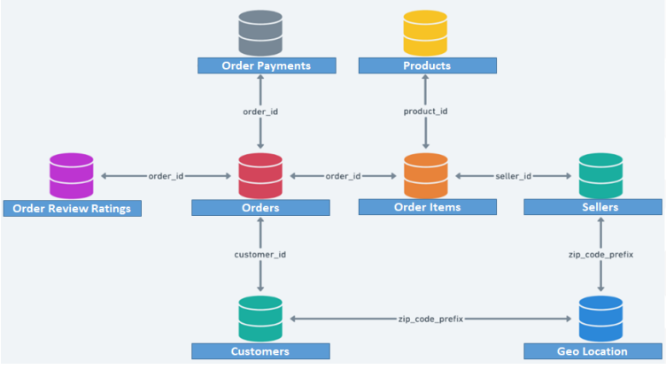

# E-Commerce Data Analysis
This project focuses on analyzing a e-commerce dataset to understand customer behavior, sales performance, seasonality, and customer retention. The goal is to simulate realistic business insights

---

## About dataset
The client is one of the leading online marketplaces in India and would like to partner with Analytixlabs.
Client wants help in measuring, managing, and analysing performance of business.
Analytixlabs has hired you as an analyst for this project where client asked you to provide data-driven insights about business and understand customer, seller behaviors, product behavior, and channel behavior etc…

### 📅 Available Data
Data has been provided for the period of Sep 2016 to Oct 2018, and the below is the data model.

### 📊 Tables
Customers: Customers information

Sellers: Sellers information

Products: Product information

Orders: Orders info like ordered, product id, status, order dates etc.

Order_Items: Order level information

Order_Payments: Order payment information

Order_Review_Ratings: Customer ratings at order level

Geo-Location: Location details

### 🗂️ Data Model

## Dataset source
- [Marketing Analytics](https://www.kaggle.com/datasets/rishikumarrajvansh/marketing-analytics/data?select=ORDER_PAYMENTS.csv)
